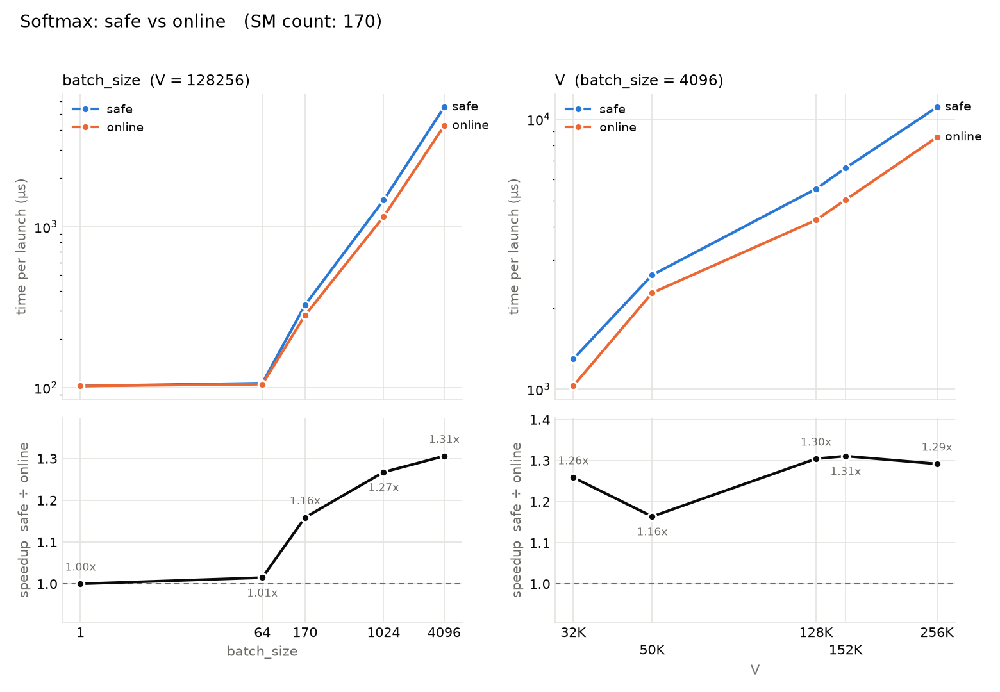

# softmax
Implementation of [Online normalizer calculation for softmax](https://arxiv.org/pdf/1805.02867) for learning purpose.

## Benchmark on RTX 5090



To reproduce:
```bash
cmake -B build && cmake --build build && ./build/softmax_bench | python3 plot_bench.py -o bench.png
```

## Future directions

- Implement Softmax + TopK fusion
- Add robust tests (FP numerical analysis)
- Study Pytorch's [Softmax.cu](https://github.com/pytorch/pytorch/blob/main/aten/src/ATen/native/cuda/SoftMax.cu)

## References
- [Online normalizer calculation for softmax](https://arxiv.org/pdf/1805.02867)
- [Milakov's implementation](https://github.com/NVIDIA/online-softmax/tree/master)

## Note
- Tests and `plot_bench.py` are Claude generated.
